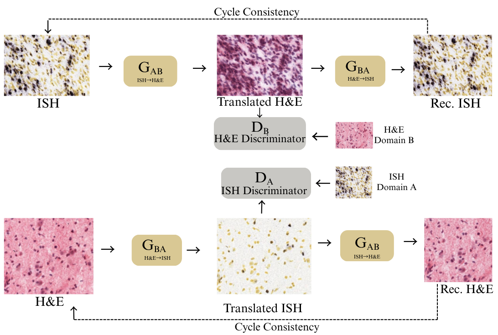
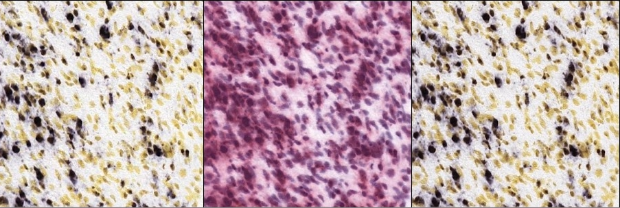
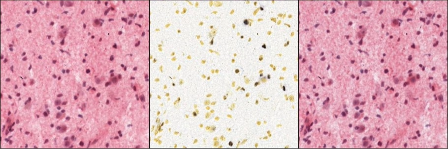

# CBAM-CycleGAN for Bidirectional ISH ↔ H&E Virtual Staining

**Attention-enhanced, unpaired image-to-image translation between in-situ hybridization (ISH) and Hematoxylin & Eosin (H&E) whole-slide sections in glioblastoma, trained and evaluated on the IvyGAP dataset.**

[](LICENSE)
[](https://www.python.org/)
[](https://pytorch.org/)
[]()

This repository contains the official implementation accompanying the paper **"Bidirectional Translation Between ISH and H&E Glioblastoma Tissue Sections via Attention-Enhanced CycleGAN"** (COMPAYL workshop, MICCAI 2026).

---

## Overview

Glioblastoma (GBM) is characterized by profound spatial heterogeneity at both the morphological and molecular level. H&E staining reveals tissue architecture and nuclear morphology; ISH maps the spatial distribution of specific gene transcripts at cellular resolution. In practice, both stains are almost never available for the *same* tissue region. Serial sectioning yields only adjacent sections (typically 10-20 µm apart), each additional stain consumes irreplaceable biopsy material, and staining adds cost and turnaround time.

**Virtual staining** removes this trade-off: by learning a computational mapping between the two modalities, it enables morphology and gene-expression signal to be examined within the *same* tissue region, without consuming additional tissue or time.

This project introduces **CBAM-CycleGAN**, a CycleGAN extended with a **Convolutional Block Attention Module (CBAM)** in the generator bottleneck, a corrected loss-weighting scheme, and auxiliary structural constraints (cycle SSIM + Sobel edge losses), for **unpaired, bidirectional** ISH ↔ H&E translation. To the best of our knowledge, this is the first published study of bidirectional ISH ↔ H&E translation in glioblastoma.

### Key contributions

- **CBAM-CycleGAN**: an attention-enhanced CycleGAN with channel + spatial attention inserted after every third residual block, targeting the sparse, punctate chromogenic ISH signal that a standard CycleGAN bottleneck under-represents.
- **Multi-checkpoint evaluation** across eleven saved states, exposing a critical dissociation between validation proxy loss and distributional quality (FID): the checkpoints with the lowest proxy loss are *not* the ones with the best distributional fidelity.
- **First bidirectional ISH ↔ H&E benchmark** on IvyGAP: FID 34.359 (ISH→H&E, epoch 20) and FID 29.577 (H&E→ISH, epoch 42), with cycle-reconstruction SSIM between 0.968 and 0.976.
- **Cross-gene generalization**: a model trained exclusively on CD44 is applied without retraining to IDH1 and EGFR subsets and remains competitive.
- **Controlled ablation** isolating CBAM and the loss reweighting, showing their benefit is direction-dependent: both help H&E→ISH monotonically, while ISH→H&E gains are more nuanced.

---

## Architecture

<p align="center">
  
</p>

Two generator/discriminator pairs are trained jointly:

- **G<sub>AB</sub>**: ISH → H&E, evaluated by discriminator **D<sub>B</sub>**
- **G<sub>BA</sub>**: H&E → ISH, evaluated by discriminator **D<sub>A</sub>**

Each generator is a 9-block ResNet (Zhu et al., CycleGAN, ICCV 2017): a reflection-padded 7×7 input convolution, two strided downsampling stages, nine residual blocks, two transposed-convolution upsampling stages, and a 7×7 `tanh` output convolution. A **CBAM** block (Woo et al., ECCV 2018) is inserted after residual blocks 3, 6, and 9, giving three attention stages at 128×128, 256-channel resolution, combining channel attention (shared MLP over average/max-pooled descriptors, reduction ratio 16) with spatial attention (7×7 convolution over channel-pooled maps). Both discriminators are 70×70 PatchGAN networks (Isola et al., pix2pix, CVPR 2017).

Since adjacent ISH/H&E sections are **not** pixel-aligned, all structural constraints are applied only to same-domain **cycle reconstructions** (e.g. ISH → H&E → ISH), never across domains.

### Loss function

| Term | Weight (λ) | Role |
|---|---|---|
| Adversarial (LSGAN) | n/a | Match the target-domain distribution |
| Cycle L1 | 10.0 | Preserve content through round-trip reconstruction |
| Identity | 0.5 | Discourage unnecessary changes to target-domain inputs |
| Cycle SSIM | 2.0 | Preserve structural tissue information (same-domain only) |
| Cycle Sobel edge | 1.0 | Preserve fine morphological boundaries (same-domain only) |

Discriminators use one-sided label smoothing (real targets at 0.9) and a 50-image replay buffer per domain. The discriminator learning rate is set to half the generator's (1×10⁻⁴ vs. 2×10⁻⁴) to prevent early discriminator dominance. A VGG perceptual term was evaluated and excluded, since it induced training collapse on this stain pair, consistent with prior stain-transfer literature.

---

## Dataset

Experiments use the **[IvyGAP](https://glioblastoma.alleninstitute.org/)** (Ivy Glioblastoma Atlas Project) dataset: 100 matched CD44 ISH and H&E whole-slide images from 42 GBM donors, each pair from adjacent sections ~20 µm apart (~15,040 × 18,080 px at 0.49 µm/px).

| Step | Detail |
|---|---|
| Tiling | Non-overlapping 512×512 patches; patches with <70% tissue coverage discarded |
| Split | Donor-level, 31 / 5 / 6 donors → train / val / test |
| Patch counts | 57,935 (train) / 12,378 (val) / 13,848 (test) |
| Normalization | Pixel values scaled to [-1, 1]; random horizontal/vertical flips during training |

The dataset is publicly available under IvyGAP's open license and is not redistributed in this repository. Point `data.data_root` in [`configs/default.yaml`](configs/default.yaml) at your own tiled patches, laid out as:

```
patches_512/
├── train/{ISH,HE}/*.jpg
├── val/{ISH,HE}/*.jpg
└── test/{ISH,HE}/*.jpg
```

`scripts/split_dataset.py` divides an already-tiled pool of patches into `train/` and `val/` subsets at a fixed ratio; test-set patches should come from donors held out at tiling time, keeping the split at the donor level.

---

## Repository structure

```
cbam-cyclegan-virtual-staining/
├── src/
│   ├── attention.py     # Channel / spatial attention, CBAM
│   ├── networks.py      # Generator (ResNet + CBAM) and PatchGAN discriminator
│   ├── losses.py        # Cycle SSIM and Sobel edge losses
│   ├── datasets.py      # Unpaired patch dataset + replay buffer
│   ├── metrics.py       # FID, KID, LPIPS, cycle SSIM/PSNR, inference
│   ├── config.py        # YAML config loader with dotted-key overrides
│   ├── train.py         # Training loop, checkpointing, early stopping
│   └── evaluate.py      # Checkpoint evaluation on val/test splits
├── scripts/
│   └── split_dataset.py # Train/val patch splitting utility
├── configs/
│   └── default.yaml     # Hyperparameters reproducing the paper's CD44 model
├── assets/               # Architecture diagram and qualitative results
├── requirements.txt
└── CITATION.cff
```

---

## Installation

```bash
git clone https://github.com/Ayesha-code-arch/cbam-cyclegan-virtual-staining.git
cd cbam-cyclegan-virtual-staining
pip install -r requirements.txt
```

Requires Python 3.10+ and a CUDA-capable GPU for training at 512×512 resolution (batch size 4 fits on a 24 GB GPU such as an L4/3090).

---

## Usage

**1. Prepare patches** (after tiling whole-slide images into 512×512 `ISH`/`HE` patches):

```bash
python scripts/split_dataset.py --root /path/to/patches_512 --val_split 0.15
```

**2. Train:**

```bash
python -m src.train --config configs/default.yaml \
    --set data.data_root=/path/to/patches_512
```

Training resumes automatically from the latest checkpoint in `output.checkpoint_dir` if one exists. Sample grids (real / translated / reconstructed, both directions) are written every epoch; full FID/KID/LPIPS evaluation runs every `eval.full_eval_freq` epochs (default: 10), since, as shown in our checkpoint study, the cheap proxy loss alone is not a reliable stopping criterion.

**3. Evaluate one or more checkpoints:**

```bash
python -m src.evaluate --config configs/default.yaml \
    --checkpoints outputs/checkpoints/ckpt_0020_best_val.pth \
                  outputs/checkpoints/ckpt_0042_latest.pth \
    --split test --out outputs/results/test_eval.csv
```

All hyperparameters (architecture width, loss weights, learning rates, schedule) live in [`configs/default.yaml`](configs/default.yaml) and can be overridden per-run with `--set key.subkey=value`.

**4. Translate a folder of images with a trained checkpoint:**

Open [`scripts/run_inference.py`](scripts/run_inference.py), set `CHECKPOINT_PATH`, `INPUT_DIR`, `DIRECTION` (`ish2he` or `he2ish`), and `EXPERIMENT_NAME` at the top of the file, then run:

```bash
python scripts/run_inference.py
```

Translated JPGs (quality 100, original filenames preserved) are written to `experiment_outputs/<EXPERIMENT_NAME>/`.

---

## Pretrained checkpoints

The two checkpoints reported in the paper are hosted on Hugging Face: **[ashshaz/cbam-cyclegan-virtual-staining](https://huggingface.co/ashshaz/cbam-cyclegan-virtual-staining)**.

| File | Epoch | Recommended direction | Test FID | Test cycle SSIM |
|---|---|---|---|---|
| `ckpt_0020.pth` | 20 | ISH → H&E | 34.359 | 0.974 |
| `ckpt_0042.pth` | 42 | H&E → ISH | 29.577 | 0.976 |

```python
import torch
from huggingface_hub import hf_hub_download
from src.networks import Generator, strip_compile_prefix

checkpoint_path = hf_hub_download(repo_id="ashshaz/cbam-cyclegan-virtual-staining", filename="ckpt_0020.pth")
state = torch.load(checkpoint_path, map_location="cpu")

g_ab = Generator(ngf=64, n_blocks=9, cbam_every=3)
g_ab.load_state_dict(strip_compile_prefix(state["G_AB"]))
g_ab.eval()
```

---

## Results

### Test-set performance (CD44)

| Epoch | FID↓ ISH→HE | FID↓ HE→ISH | KID↓ ISH→HE | KID↓ HE→ISH | SSIM↑ ISH | SSIM↑ HE | PSNR↑ ISH | PSNR↑ HE |
|---|---|---|---|---|---|---|---|---|
| 19 | 33.776 | 48.966 | 0.019 | 0.041 | 0.969 | 0.968 | 34.767 | 29.842 |
| **20** | **34.359** | 48.746 | 0.020 | 0.037 | **0.974** | 0.973 | 35.345 | 32.187 |
| 27 | 41.945 | 32.084 | 0.028 | 0.020 | 0.974 | 0.975 | 34.747 | 32.424 |
| **42** | 56.054 | **29.577** | 0.043 | **0.017** | 0.974 | **0.976** | **35.959** | 28.781 |

Epoch 20 is the deployed ISH→H&E checkpoint; epoch 42 is the deployed H&E→ISH checkpoint. Cycle SSIM stays uniformly high (0.968 to 0.976) across all reported checkpoints, indicating structural self-consistency holds regardless of which checkpoint best matches the target distribution.

### Ablation study (test set, matched 512×512 / 9-block architecture)

| Configuration | CBAM | Aux. losses | FID↓ ISH→HE | FID↓ HE→ISH | SSIM↑ ISH | SSIM↑ HE |
|---|:---:|:---:|---|---|---|---|
| Standard CycleGAN | ✗ | ✗ | **32.158** | 46.569 | 0.959 | 0.944 |
| No-CBAM (full losses) | ✗ | ✓ | 36.010 | 36.908 | 0.960 | 0.974 |
| **Full model (ours)** | ✓ | ✓ | 34.359 | **29.577** | **0.974** | **0.976** |

CBAM alone improves FID in both directions relative to the no-CBAM configuration (4.6% for ISH→H&E, 19.9% for H&E→ISH), indicating attention helps most when *generating* the sparse ISH signal rather than merely reading it as input. For H&E→ISH, CBAM and the auxiliary losses help cumulatively (FID 46.569 → 36.908 → 29.577). Cycle SSIM improves monotonically in both directions across all three configurations.

### Cross-gene generalization (no retraining)

| Gene | Epoch | FID↓ ISH→HE | FID↓ HE→ISH | SSIM↑ ISH | SSIM↑ HE |
|---|---|---|---|---|---|
| CD44 (trained) | 20 | 34.359 | 48.746 | 0.974 | 0.973 |
| CD44 (trained) | 42 | 56.054 | 29.577 | 0.974 | 0.976 |
| EGFR | 20 | 47.039 | 66.198 | 0.954 | 0.963 |
| EGFR | 42 | 50.030 | 61.130 | 0.958 | 0.973 |
| IDH1 | 20 | 63.130 | 117.620 | 0.959 | 0.945 |
| IDH1 | 42 | 66.470 | 106.230 | 0.948 | 0.969 |

The CD44-trained model transfers to EGFR and IDH1 without any additional fine-tuning. Cycle SSIM remains ≥0.945 across every gene and direction, confirming structural self-consistency under domain shift even as distributional fidelity (FID) degrades, more so for IDH1, whose diffuse, lower-density chromogenic pattern differs most from the dense, focal CD44 signal the model was trained on.

### Qualitative results

<table>
<tr>
<td align="center" width="50%">
<br>
<b>ISH → H&E → ISH</b> (epoch 20)<br>
<sub>real ISH · translated H&E · reconstructed ISH</sub>
</td>
<td align="center" width="50%">
<br>
<b>H&E → ISH → H&E</b> (epoch 42)<br>
<sub>real H&E · translated ISH · reconstructed H&E</sub>
</td>
</tr>
</table>

### The proxy-loss trap

A central finding of this work: **validation generator loss is a poor surrogate for translation quality.** Across eleven evaluated checkpoints, the epoch with the single lowest proxy loss (epoch 26, val_G = 1.072) coincided with a substantially *elevated* FID (57.984 ISH→H&E). The network was satisfying every training objective through small, reversible transformations rather than genuine staining translation. This is consistent with theoretical results showing CycleGAN's objective admits multiple exact solutions, including trivial automorphisms of the target domain. Practically, this means **periodic FID/KID computation is necessary alongside proxy-loss monitoring**, and it cannot be skipped as an optimization for training speed. `src/train.py` implements this directly: cheap proxy-loss validation runs every epoch, while full distributional evaluation runs on a configurable cadence.

---

## Citation

If this repository is useful in your research, please cite:

```bibtex
@inproceedings{shahzad2026cbamcyclegan,
  title     = {Bidirectional Translation Between ISH and H\&E Glioblastoma Tissue Sections via Attention-Enhanced CycleGAN},
  author    = {Shahzad, Ayesha and Koukoutegos, Konstantinos and Makris, Dimitrios and Bakas, Spyridon},
  booktitle = {COMPAYL Workshop, MICCAI 2026},
  year      = {2026}
}
```

See [`CITATION.cff`](CITATION.cff) for a machine-readable citation record.

---

## Acknowledgments

This study uses the publicly available, de-identified [IvyGAP](https://glioblastoma.alleninstitute.org/) dataset, released under an open license. No additional ethical approval was required.

---

## License

Released under the [MIT License](LICENSE).

---

## Contact

**Ayesha Shahzad**
Department of Computer Science, Kingston University London

- Email: [ayeshashahzad156@hotmail.com](mailto:ayeshashahzad156@hotmail.com)
- LinkedIn: [linkedin.com/in/ayesha-shahzad-pleaseclick](https://www.linkedin.com/in/ayesha-shahzad-pleaseclick)
- Portfolio: [ayesha-code-arch.github.io/portfolio](https://ayesha-code-arch.github.io/portfolio/)
- GitHub: [@Ayesha-code-arch](https://github.com/Ayesha-code-arch)
